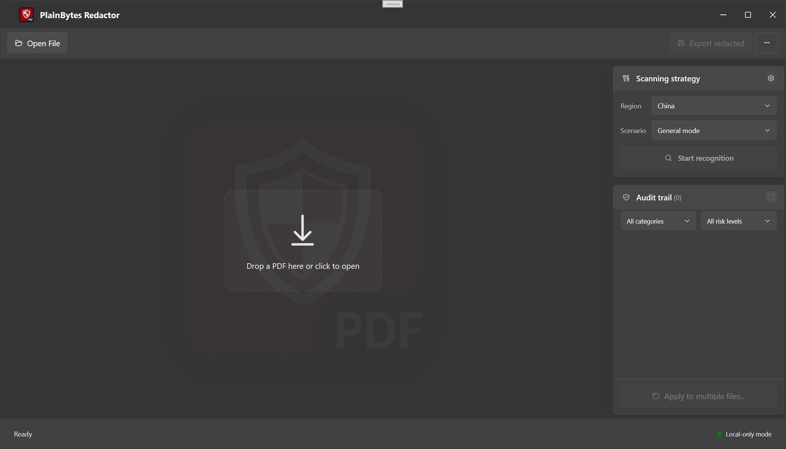
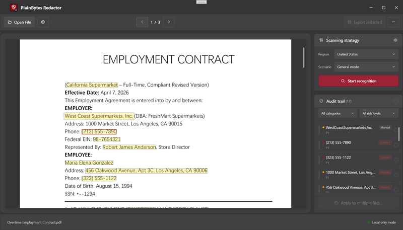
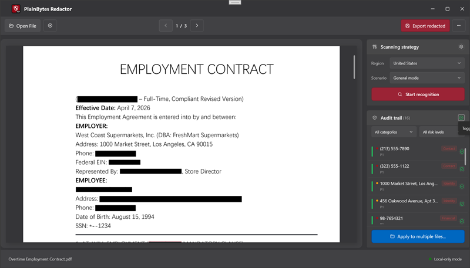
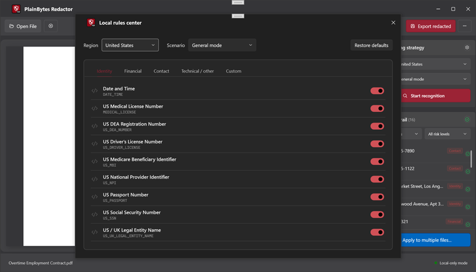
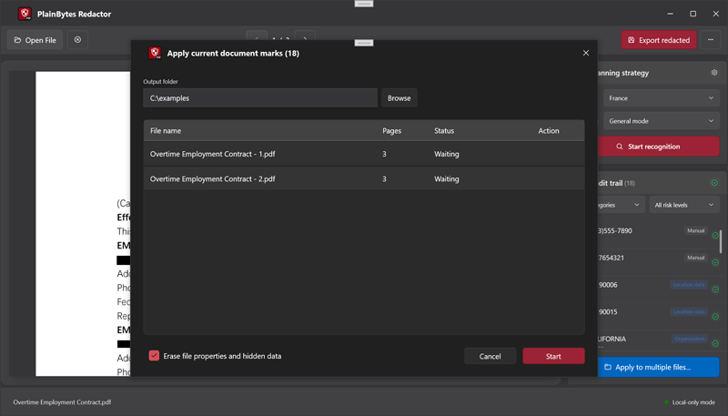

# PlainBytes PDF Redactor

*PlainBytes Studio · Windows Desktop*

**Local-first PDF redaction** — detect, review, and export on your device.

PlainBytes PDF Redactor is a local-first PDF redaction tool for Windows. It helps you detect, review, and remove sensitive information from PDFs in a practical workflow that stays fully local. Core processing runs on your device; document uploads to our servers are not required for the core features.

**Windows** · **Local-first** · **Proprietary**

  
   
  <em>Main application window</em>

## Overview

PlainBytes PDF Redactor combines AI-assisted detection, rule-based scanning, manual review, and physical redaction export into a focused workflow for sensitive PDFs.

Intended for workflows such as:

- legal review
- finance and accounting
- audit preparation
- internal document handling
- controlled document sharing

## Screenshots

|  |  |
| :-----------------------------------------------------------: | :----------------------------------------------------------: |
| *Audit & detection* | *Review & document* |

|  |  |
| :-------------------------------------------: | :-------------------------------------------: |
| *Document & marks* | *Workflow / batch* |

## Core Capabilities

- Offline PDF redaction workflow
- AI-assisted detection for names, organizations, locations, and dates
- Rule-based detection for IDs, phone numbers, bank cards, email addresses, postal codes, and regional identifiers
- Physical PDF redaction export
- Metadata cleanup
- Batch processing for similar PDF files
- Review and confirmation workflow before export
- Multilingual interface

## Product Workflow

1. Open a PDF document
2. Run automatic detection
3. Review detected items in the audit panel
4. Confirm or adjust redaction results
5. Export a physically redacted PDF

## Key Principles

### Local-First Processing

Core document detection, review, and export workflows are designed to run locally on the user's device.

### Practical Review Workflow

The product is built around a practical review process instead of a fully automatic black-box approach.

### Focused Product Scope

PlainBytes PDF Redactor is a dedicated PDF redaction tool, not a general-purpose PDF office suite.

## Supported Interface Languages

- English
- 简体中文
- 繁體中文
- 日本語
- 한국어
- Deutsch
- Français
- Русский
- Português
- Italiano
- العربية
- Español
- Nederlands

## Regional Rule Coverage

The built-in rule library includes detection coverage across 20+ regions and 100+ structured detection rules.

## Platform

- Windows Desktop

## Distribution

PlainBytes PDF Redactor is distributed through:

- Microsoft Store
- Official product channels operated by PlainBytes Studio

[**Download from Microsoft Store**](https://apps.microsoft.com/detail/9N2VLPN4WDK1)

## Built With

- **.NET 8 WPF** — desktop shell and UI
- **CommunityToolkit.Mvvm** — MVVM patterns
- **PdfPig** — PDF text / structure (read)
- **Pdfium** — rendering
- **iText7 + PdfSweep** — physical redaction (write)
- **SkiaSharp** — drawing / overlays
- **ONNX Runtime** — on-device inference

## Privacy

The core document workflow does not require uploading PDFs to external servers. See [Privacy Policy](../website/privacy.html) for details.

## Support

For product support, release information, and related materials, please refer to the official PlainBytes Studio channels.

## License & Legal

This software is proprietary. Usage is governed by the End User License Agreement (EULA) presented in the product.

This repository is used for product management, release distribution, and related materials. Source code is not licensed for public use, redistribution, or modification.

Copyright © 2026 PlainBytes Studio. All rights reserved.
